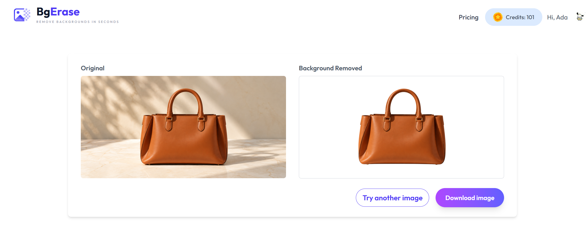

# BgErase — Image Background Remover

BgErase is a full-stack image background removal web application built with React and Spring Boot. It allows users to upload images, remove their backgrounds using the Clipdrop API, preview and download processed results, and purchase credits for additional image processing.

------

## Screenshots

### Homepage 


### Image Processing



------

## Key Features

- Register and sign in with Clerk
- Upload images for background removal
- Preview and download processed images
- View available credit balance
- Purchase additional credits through Stripe

------

## Tech Stack

| Area            | Technologies                |
| --------------- | --------------------------- |
| Frontend        | React, Tailwind CSS, Axios  |
| Backend         | Java, Spring Boot           |
| Persistence     | MySQL, Spring Data JPA      |
| Authentication  | Clerk, Spring Security, JWT |
| API Integration | OpenFeign, Clipdrop API     |
| Payments        | Stripe Checkout             |

------

## Technical Highlights

- **JPA Persistence:** Used Spring Data JPA and MySQL to persist user profiles, credit balances and payment orders.
- **Authentication:** Integrated Clerk with Spring Security and validated JWTs using Clerk public keys.
- **Image Processing:** Integrated the Clipdrop API through OpenFeign to send uploaded images for background removal and return processed results.
- **Credit System:** Implemented a credit-based usage flow that checks and deducts user credits when processing images.
- **Payment Integration:** Integrated Stripe Checkout for purchasing additional credits and verifying successful payments before updating credit balances.

------

## Architecture

```text
React Application
       │
       ▼
Spring Boot REST API ───────── MySQL
       │
       ├──────── Clerk
       │
       ├──────── Clipdrop API
       │
       └──────── Stripe
```

The React frontend communicates with the Spring Boot REST API for user, image and payment operations. The backend validates Clerk authentication, persists application data in MySQL, calls the Clipdrop API for background removal, and integrates with Stripe for credit purchases.

------

## Project Structure

```text
.
├── frontend/        # React customer application
├── removebg/         # Spring Boot backend
├── screenshots/     # Project screenshots
└── README.md
```

------

## Running Locally

### Prerequisites

Java 21, Node.js, MySQL, Clerk, Clipdrop API credentials and Stripe test credentials are required.

Configure the required database, Clerk, Clipdrop and Stripe credentials before starting the application.

### Backend

```bash
cd removebg
./mvnw spring-boot:run
```

### Frontend

```bash
cd frontend
npm install
npm run dev
```

The frontend runs on `http://localhost:5173`.